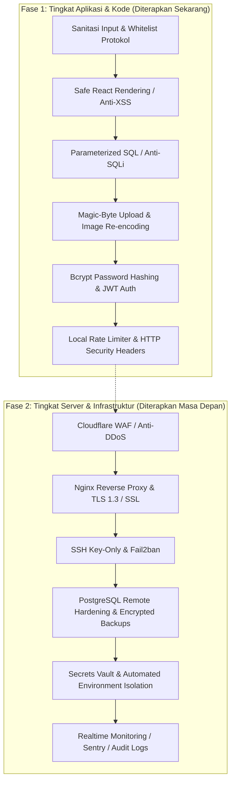

# 🛡️ Panduan & Checklist Standar Keamanan Sistem (Security Blueprint & Checklist)
### Proyek: Catavor (DFauna Multi-Channel SaaS Platform)
*Dokumen ini memuat panduan komprehensif kepatuhan keamanan industri (OWASP Top 10, SOC 2, ISO 27001) yang terbagi menjadi dua fase: Keamanan Tingkat Aplikasi Lokal (Sekarang) dan Keamanan Tingkat Server & Infrastruktur (Masa Depan).*

---

## 📋 DAFTAR ISI
1. [Ringkasan Eksekutif (*Executive Summary*)](#1-ringkasan-eksekutif)
2. [Fase 1: Checklist Keamanan Tingkat Aplikasi & Kode Lokal (Sekarang)](#2-fase-1-keamanan-tingkat-aplikasi--kode-lokal-sekarang)
   - [2.1 Validasi & Sanitasi Seluruh Isian Form (Input Defense)](#21-validasi--sanitasi-seluruh-isian-form-input-defense)
   - [2.2 Keamanan Render & Frontend React (Anti-XSS)](#22-keamanan-render--frontend-react-anti-xss)
   - [2.3 Keamanan Database & Parameterized Query (Anti-SQLi)](#23-keamanan-database--parameterized-query-anti-sqli)
   - [2.4 Keamanan Unggah Berkas & Gambar (File Upload Hardening)](#24-keamanan-unggah-berkas--gambar-file-upload-hardening)
   - [2.5 Keamanan Autentikasi, Password & Sesi (Auth Hardening)](#25-keamanan-autentikasi-password--sesi-auth-hardening)
   - [2.6 Middleware Keamanan HTTP & Rate Limiting](#26-middleware-keamanan-http--rate-limiting)
3. [Fase 2: Checklist Keamanan Tingkat Server & Infrastruktur Produksi (Masa Depan)](#3-fase-2-keamanan-tingkat-server--infrastruktur-produksi-masa-depan)
   - [3.1 Jaringan, Firewall & Reverse Proxy (Network & WAF)](#31-jaringan-firewall--reverse-proxy-network--waf)
   - [3.2 Enkripsi Komunikasi & Sertifikat SSL/TLS](#32-enkripsi-komunikasi--sertifikat-ssltls)
   - [3.3 Pengerasan Server & Akses SSH (Server Hardening)](#33-pengerasan-server--akses-ssh-server-hardening)
   - [3.4 Database Hardening & Disaster Recovery (Backup)](#34-database-hardening--disaster-recovery-backup)
   - [3.5 Manajemen Rahasia (*Secrets Management*) & Konfigurasi](#35-manajemen-rahasia-secrets-management--konfigurasi)
   - [3.6 Monitoring, Log Audit & Deteksi Ancaman (SIEM)](#36-monitoring-log-audit--deteksi-ancaman-siem)
   - [3.7 Pipeline CI/CD & Pemindaian Kerentanan (DevSecOps)](#37-pipeline-cicd--pemindaian-kerentanan-devsecops)
4. [Tabel Matriks Kesiapan Keamanan (*Security Readiness Matrix*)](#4-tabel-matriks-kesiapan-keamanan)

---

## 1. Ringkasan Eksekutif

Keamanan sistem informasi modern menganut prinsip **Defense-in-Depth** (pertahanan berlapis). Keamanan tidak hanya bergantung pada firewall server, melainkan harus dibangun secara solid dari baris kode aplikasi (tingkat lokal) hingga ke konfigurasi pusat data dan jaringan cloud (tingkat server).

---

## 2. Fase 1: Keamanan Tingkat Aplikasi & Kode Lokal (Sekarang) - ✅ SELESAI DITERAPKAN

*Status: **100% Selesai & Terverifikasi** pada 28 Agustus 2026.*

### 2.1 Validasi & Sanitasi Seluruh Isian Form (Input Defense)
Setiap data yang masuk dari pengguna (*untrusted user input*) disanitasi secara otomatis menggunakan modul terpusat [`backend/internal/security/sanitizer.go`](file:///c:/MyProject/DFauna/backend/internal/security/sanitizer.go):

- [x] **Sanitasi Teks Polos (*Plain Text Fields*)**:
  - Hapus semua tag HTML (`<...>` dan tag tak tertutup).
  - Hapus karakter kontrol biner dan null-bytes (`\x00`).
  - Lakukan pembatasan panjang karakter (*string length clamp*) untuk mencegah *buffer overflow* atau *database payload bloating*.
  - *Penerapan*: `SanitizePlainText(input, maxLen)` pada nama user, judul artikel, nama produk/fauna, profil toko, lokasi penampakan, dan catatan.
- [x] **Sanitasi Rich Text / Markdown (*Rich Content Fields*)**:
  - Hapus tag skrip dan elemen eksekusi berbahaya: `<script>`, `<iframe>`, `<object>`, `<embed>`, `<style>`, `<form>`, `<input>`.
  - Hapus semua atribut inline JavaScript / Event Handlers (`onload`, `onerror`, `onclick`, `onmouseover`, `onfocus`, dsb.).
  - Pertahankan struktur markdown murni (`#`, `##`, `*`, `**`, `-`, `1.`, `>`) yang aman.
  - *Penerapan*: `SanitizeRichText(input, maxLen)` pada deskripsi artikel, konten artikel, deskripsi katalog, *About Us*, dan teks kebijakan (*privacy/terms*).
- [x] **Validasi & Whitelist Protokol URL (*URL Protocol Whitelist*)**:
  - Pastikan setiap input URL hanya menggunakan skema protokol resmi yang aman: `https://`, `http://`, `mailto:`, dan `tel:`.
  - Blokir secara mutlak skema berbahaya: `javascript:`, `data:`, `vbscript:`, `file:`.
  - Khusus URL Video: Batasi hanya pada domain video resmi terpercaya (`youtube.com`, `youtu.be`).
  - *Penerapan*: `SanitizeURL(rawURL)` dan `SanitizeVideoURL(rawURL)` pada tautan sosial media toko, website resmi, dan URL video fauna.
- [x] **Validasi Nomor Telepon & WhatsApp**:
  - Hanya izinkan karakter numerik (`0-9`), tanda plus (`+`), tanda minus (`-`), dan spasi.
  - Hapus karakter alfabetis dan simbol manipulasi URL.
  - *Penerapan*: `SanitizePhone(phone)` pada nomor WhatsApp toko, nomor kontak aduan, dan kontak observer.
- [x] **Validasi Numerik & Batasan Nilai (*Numeric Bounds*)**:
  - Validasi harga produk (`price >= 0` dan tidak `NaN` / `+Inf`).
  - Validasi koordinat peta (`-90 <= latitude <= 90`, `-180 <= longitude <= 180`).
  - *Penerapan*: `ValidatePrice(price)` pada katalog fauna dan batasan latitude/longitude di `setting_handler.go`.

---

### 2.2 Keamanan Render & Frontend React (Anti-XSS)
- [x] **Eliminasi Penggunaan `dangerouslySetInnerHTML`**:
  - 100% injeksi HTML mentah telah dihapus dari seluruh aplikasi Desktop dan Mobile.
  - Menggunakan komponen AST parser yang aman ([`FormattedText`](file:///c:/MyProject/DFauna/frontend/mobile/src/App.tsx)) yang merender virtual DOM React JSX (`<strong>`, `<em>`, `<h3>`, `<ul>`) dengan proteksi *React DOM Auto-Escaping*.
- [x] **Sanitasi Link Eksternal (*Safe Link Protocol Handler*)**:
  - Utilitas [`safeHref(url)`](file:///c:/MyProject/DFauna/frontend/mobile/src/App.tsx) diterapkan pada seluruh tombol tautan dinamis `<a>`.
  - Link `javascript:` atau `data:` dinetralisir menjadi `#` atau `about:blank`.
  - Semua link keluar dilengkapi atribut `rel="noopener noreferrer"` dan `target="_blank"`.

---

### 2.3 Keamanan Database & Parameterized Query (Anti-SQLi)
- [x] **100% Parameterized Query via GORM**:
  - Seluruh query database menggunakan placeholder terparameter (`db.Where("LOWER(name) LIKE ?", "%"+input+"%")`).
  - Zero SQL string concatenation.
- [x] **Pemberian Indeks & Sanitasi Pengurutan (*Safe Order By Clause*)**:
  - Parameter `sort` divalidasi dengan whitelist eksplisit (`oldest`, `name_asc`, `name_desc`, `price_asc`, `price_desc`).

---

### 2.4 Keamanan Unggah Berkas & Gambar (File Upload Hardening)
- [x] **Pemeriksaan Magic-Byte (*Anti-MIME Spoofing*)**:
  - Header biner (512 byte) diperiksa menggunakan `http.DetectContentType`.
- [x] **Rekonstruksi & Pembersihan Metadata EXIF (*EXIF Stripping*)**:
  - Gambar di-decode dan di-re-encode ulang dengan library `imaging` dan `jpeg.Encode` untuk menghapus seluruh payload metadata GPS & EXIF.
- [x] **Penamaan Acak UUID (*Anti-Path Traversal*)**:
  - Nama berkas di-generate menggunakan UUID v4 (`uuid.New().String() + ".jpg"`).
- [x] **Pembatasan Ukuran Maksimal (*Payload Size Limit*)**:
  - File upload dibatasi 10MB; Fiber global BodyLimit 12MB.

---

### 2.5 Keamanan Autentikasi, Password & Sesi (Auth Hardening)
- [x] **Algoritma Hashing Password Standar Industri**:
  - Hashing **Bcrypt** dengan cost factor 12.
  - Validasi panjang password: Min 8 karakter, Max 72 karakter (mencegah *Bcrypt Truncation & CPU DoS*).
- [x] **Validasi Email Standar RFC 5322**:
  - Validasi regex RFC dan normalisasi lowercase.
- [x] **Keamanan Token JWT**:
  - Secret JWT dari Environment Variable dengan expiry 7 hari.
  - Middleware `StoreOwnerRequired` pada rute admin untuk mencegah *Horizontal Privilege Escalation (IDOR)*.
- [x] **Pencegahan Timing Attack**:
  - Constant-time string comparison `crypto/subtle.ConstantTimeCompare`.

---

### 2.6 Middleware Keamanan HTTP & Rate Limiting
- [x] **HTTP Security Headers Standar SaaS**:
  - `X-Content-Type-Options: nosniff`
  - `X-Frame-Options: SAMEORIGIN`
  - `X-XSS-Protection: 1; mode=block`
  - `Referrer-Policy: strict-origin-when-cross-origin`
  - `Permissions-Policy: geolocation=(), camera=(), microphone=()`
  - `Content-Security-Policy (CSP)` aktif di [`backend/internal/middleware/security.go`](file:///c:/MyProject/DFauna/backend/internal/middleware/security.go).
- [x] **Rate Limiting Anti-Brute Force & Anti-Spam**:
  - **Auth Rate Limiter**: Maksimal 20 req/menit pada login & register.
  - **Public Form Rate Limiter**: Maksimal 15 req/menit pada komentar artikel (`/api/articles/:id/comments`), pelaporan penampakan (`/api/sightings`), dan persetujuan kebijakan (`/api/policies/agree`).
- [x] **Panic Recovery Middleware**:
  - `recover.New()` aktif di Fiber.

---

## 3. Fase 2: Checklist Keamanan Tingkat Server & Infrastruktur Produksi (Masa Depan)

*Bagian ini wajib diterapkan saat aplikasi dideploy ke server VPS, Dedicated Server, atau Cloud Provider (AWS / GCP / DigitalOcean / Linode).*

### 3.1 Jaringan, Firewall & Reverse Proxy (Network & WAF)
- [ ] **Web Application Firewall (WAF) & Anti-DDoS (Contoh: Cloudflare)**:
  - Lindungi domain di balik Cloudflare (Proxy Mode Aktif).
  - Aktifkan Cloudflare Bot Management & Managed Ruleset untuk memfilter bot jahat dan serangan SQLi/XSS otomatis.
  - Sembunyikan IP publik server asal (*Origin IP Masking*).
- [ ] **Nginx Reverse Proxy Hardening**:
  - Pasang Nginx di depan aplikasi Go (`reverse proxy` ke `http://127.0.0.1:8000`).
  - Nonaktifkan token server di Nginx (`server_tokens off;`).
  - Konfigurasikan batas ukuran body di Nginx (`client_max_body_size 12M;`).
  - Atur buffer request untuk mencegah serangan *Slowloris* / *Slow HTTP Read*.
- [ ] **Firewall Server (UFW / Iptables)**:
  - Tutup semua port kecuali yang diperlukan:
    - Izinkan Port `22` (SSH - ubah ke port non-standar misal `2222`).
    - Izinkan Port `80` (HTTP - redirect ke HTTPS).
    - Izinkan Port `443` (HTTPS).
    - Blokir akses publik ke Port `8000` (aplikasi Go hanya boleh diakses via `localhost` oleh Nginx).
    - Blokir akses publik ke Port `5432` (PostgreSQL hanya boleh diakses secara lokal).

---

### 3.2 Enkripsi Komunikasi & Sertifikat SSL/TLS
- [ ] **Sertifikat SSL/TLS Otomatis (Let's Encrypt / Certbot)**:
  - Pasang sertifikat SSL dengan perpanjangan otomatis (*auto-renewal cron*).
  - Redirect otomatis semua trafik HTTP (Port 80) ke HTTPS (Port 443).
- [ ] **Pengerasan Konfigurasi TLS**:
  - Hanya izinkan protokol modern: **TLSv1.2** dan **TLSv1.3** (nonaktifkan SSLv2, SSLv3, TLS 1.0, TLS 1.1).
  - Konfigurasikan Cipher Suites yang aman (misal ECDHE-ECDSA-AES128-GCM-SHA256).
  - Aktifkan header **HSTS** (*HTTP Strict Transport Security*): `Strict-Transport-Security: max-age=31536000; includeSubDomains; preload`.

---

### 3.3 Pengerasan Server & Akses SSH (Server Hardening)
- [ ] **Akses SSH Berbasis Kunci Publik (*Key-Based Authentication*)**:
  - Nonaktifkan login SSH menggunakan kata sandi (`PasswordAuthentication no`).
  - Nonaktifkan login langsung akun root (`PermitRootLogin no`).
  - Buat user khusus (*non-root*) dengan hak `sudo`.
- [ ] **Proteksi Anti-Intrusi (*Fail2ban*)**:
  - Pasang dan aktifkan `fail2ban` untuk memblokir IP yang melakukan percobaan login SSH ilegal secara berulang.
  - Integrasikan fail2ban dengan log Nginx untuk memblokir IP penyerang web scanning (misal scan `/wp-admin` atau `/.env`).
- [ ] **Pembaruan Sistem Operasi Otomatis (*Unattended Upgrades*)**:
  - Aktifkan patch keamanan otomatis pada OS Linux (Ubuntu/Debian) untuk paket-paket keamanan kernel dan dependensi dasar.

---

### 3.4 Database Hardening & Disaster Recovery (Backup)
- [ ] **Pengerasan Akses PostgreSQL**:
  - Pastikan `pg_hba.conf` hanya mengizinkan koneksi dari `127.0.0.1` atau *internal private network*.
  - Gunakan kata sandi database yang kuat (>24 karakter alfanumerik acak).
  - Buat user database dengan hak akses terbatas (*least privilege*), bukan menggunakan superuser `postgres`.
- [ ] **Strategi Backup Data Otomatis & Terenkripsi (*Automated Backups*)**:
  - Buat cron job backup harian menggunakan `pg_dump`.
  - Enkripsi file backup (menggunakan GPG/OpenSSL) sebelum diunggah ke *Offsite Cloud Storage* (misal AWS S3, Cloudflare R2, Google Cloud Storage).
  - Terapkan kebijakan retensi backup:
    - Backup Harian (disimpan 7 hari).
    - Backup Mingguan (disimpan 4 minggu).
    - Backup Bulanan (disimpan 12 bulan).
  - Lakukan uji coba pemulihan data (*Disaster Recovery Drill*) secara berkala setiap 3 bulan.

---

### 3.5 Manajemen Rahasia (*Secrets Management*) & Konfigurasi
- [ ] **Isolasi Environment Variable**:
  - Jangan pernah menyimpan file `.env` di dalam repositori Git (`.gitignore` wajib mencantumkan `.env`).
  - Gunakan permissions file ketat pada server (`chmod 600 .env` dimiliki oleh user aplikasi).
  - Pada skala enterprise, gunakan secret manager (HashiCorp Vault, AWS Secrets Manager, atau Doppler).
- [ ] **Rotasi Kunci Berkala (*Key Rotation*)**:
  - Jadwalkan rotasi rutin untuk `JWT_SECRET`, database password, dan Google OAuth Client Secret (misal setiap 6 atau 12 bulan).

---

### 3.6 Monitoring, Log Audit & Deteksi Ancaman (SIEM)
- [ ] **Logging & Error Tracking Terpusat**:
  - Integrasikan error monitoring realtime (misal **Sentry** atau **Datadog**) untuk menangkap exception runtime aplikasi secara instan.
  - Pastikan log tidak merekam data sensitif (seperti password plain text, nomor kartu, atau token otentikasi).
- [ ] **Pemantauan Ketersediaan (*Uptime Monitoring*)**:
  - Pasang pemantau uptime eksternal (misal UptimeRobot / BetterStack) dengan notifikasi Telegram/Slack/Email jika server mengalami down.
- [ ] **Log Audit SOC 2**:
  - Rekam audit log setiap kali admin mengubah kebijakan privasi, mengubah role user, atau menghapus data katalog penting.

---

### 3.7 Pipeline CI/CD & Pemindaian Kerentanan (DevSecOps)
- [ ] **Automated Dependency Scanning**:
  - Aktifkan **GitHub Dependabot** untuk mendeteksi kerentanan dependensi Go (`go.sum`) dan Node.js (`package-lock.json`).
  - Pasang alat pemindai statis keamanan (*Static Application Security Testing / SAST*):
    - `gosec` untuk memindai celah keamanan pada kode Go.
    - `npm audit` / `eslint-plugin-security` untuk kode React.
- [ ] **Zero-Downtime Deployment**:
  - Gunakan systemd service atau Docker container dengan health check untuk memastikan deploy versi baru tidak mengganggu pengguna yang sedang aktif.

---

## 4. Tabel Matriks Kesiapan Keamanan

| Lapisan Keamanan (*Layer*) | Item Keamanan | Target Eksekusi | Status / Rekomendasi |
| :--- | :--- | :--- | :--- |
| **Input & Sanitasi** | Sanitasi Seluruh Form (XSS, Injection) | **Sekarang (Lokal)** | 🟢 Diterapkan di Go Backend |
| **Frontend UI** | Safe AST Rendering (Tanpa dangerous HTML) | **Sekarang (Lokal)** | 🟢 Diterapkan di React |
| **Database** | Parameterized Queries (Anti-SQLi) | **Sekarang (Lokal)** | 🟢 Aktif via GORM |
| **Media & File** | Magic-byte MIME & EXIF Stripping | **Sekarang (Lokal)** | 🟢 Aktif di `UploadImage` |
| **Autentikasi** | Bcrypt Cost 12 & Bounds Validation | **Sekarang (Lokal)** | 🟢 Diterapkan di Auth Handler |
| **Middleware** | HTTP Headers (CSP, Frame, Sniff) | **Sekarang (Lokal)** | 🟢 Diterapkan di Fiber |
| **Anti-Abuse** | Rate Limiting Login, Register, Comments | **Sekarang (Lokal)** | 🟢 Diterapkan di Fiber Limiter |
| **Jaringan & WAF** | Cloudflare DDoS Shield & Proxy | **Masa Depan (Server)** | 🟡 Wajib saat rilis domain publik |
| **Enkripsi Data** | SSL/TLS 1.3 & Auto Let's Encrypt | **Masa Depan (Server)** | 🟡 Wajib saat setup VPS / Nginx |
| **Akses Server** | SSH Key-Only & Fail2ban | **Masa Depan (Server)** | 🟡 Konfigurasi OS Linux |
| **Disaster Recovery** | Backup Database Harian Terenkripsi | **Masa Depan (Server)** | 🟡 Setup Cron + Cloud Storage |
| **DevSecOps** | Dependabot & Gosec CI/CD Scanner | **Masa Depan (Server)** | 🟡 Integrasi GitHub Actions |

---
*Dokumen ini dibuat sebagai standar operasional prosedur (SOP) keamanan pengembangan dan operasional sistem Catavor (DFauna).*
