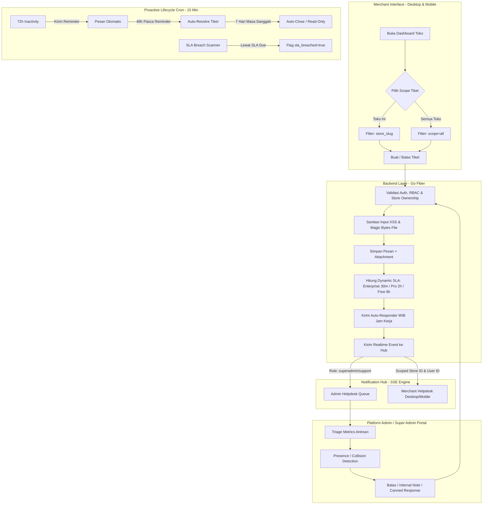
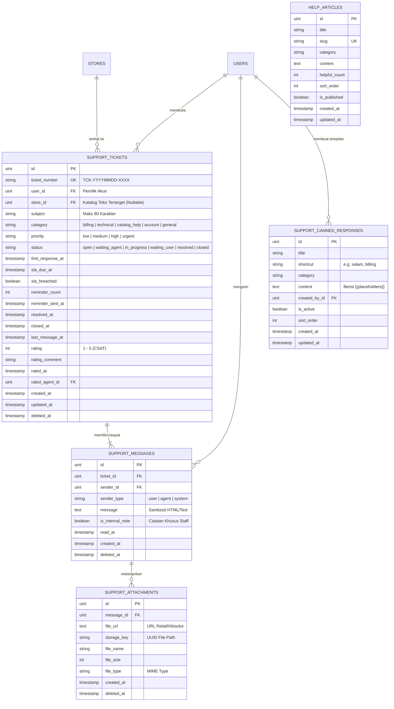
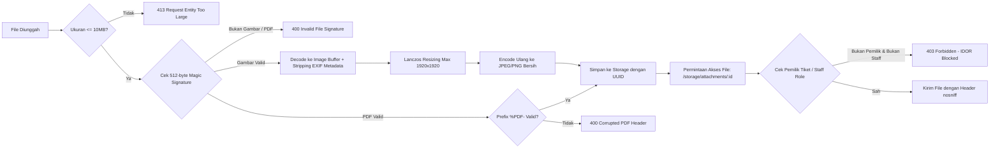

# BLUEPRINT TEKNIS: SISTEM TIKET BANTUAN & HELPDESK MULTI-TENANT
**Kode Dokumen:** `DOC-FEAT-01-SUPPORT`  
**Modul:** Support Helpdesk, Ticketing, Live Chat & SLA Management  
**Versi:** 2.0.0 (Production Ready)  
**Terakhir Diperbarui:** 2026-09-20  
**Target Arsitektur:** Multi-Tenant SaaS (Merchant Admin & Super Admin/Staff Portal)  

---

## 1. Ringkasan Eksekutif & Arsitektur Utama

Sistem Tiket Bantuan (*Support Ticketing & Helpdesk*) Catavor dirancang untuk menangani interaksi dua arah antara **Pemilik Toko/Merchant** dan **Tim Customer Support / Super Admin**. Sistem ini menerapkan arsitektur *Store-Scoped Context with Account Umbrella* (standar industri SaaS seperti Stripe, Shopify, Zendesk, dan AWS Support).



---

## 2. Stack Teknologi & Pustaka Pendukung

| Lapisan | Teknologi / Pustaka | Peran & Alasan Pemilihan |
| :--- | :--- | :--- |
| **Backend Core** | **Go (Golang 1.22+)** | Performa tinggi (*low latency*, *concurrency* goroutine efisien untuk ribuan koneksi realtime). |
| **Web Framework** | **Fiber v2 (FastHTTP)** | Routing secepat kilat dengan alokasi memori minimal. |
| **Database ORM** | **GORM v1.25+** | Pemetaan relasi objek basis data dengan dukungan *eager/lazy loading*, transaksi, dan migrasi terstruktur. |
| **Logging & Security** | **Zerolog & Custom Sanitizer** | Structured logging cepat dan sanitasi string (*XSS mitigation*, URL parser). |
| **Media Processing** | **disintegration/imaging** | Pemrosesan citra di memori, EXIF metadata stripping, dan algoritma resize *Lanczos*. |
| **Realtime Engine** | **Server-Sent Events (SSE)** | Komunikasi satu arah server-ke-klien yang ringan, stabil melalui HTTP/2, dan *auto-reconnect*. |
| **Cache & State** | **Redis + In-Memory Fallback** | *Presence tracking* agen admin dan deduplikasi polling. |
| **Frontend Desktop** | **React 18 + TypeScript + Vite** | SPA desktop responsif dengan strict typing, memoization, dan dynamic import. |
| **Frontend Mobile** | **React 18 + TypeScript + Vite** | Antarmuka khusus layar sentuh mobile dengan performa tinggi. |
| **Iconography** | **Lucide Icons** | Ikon vektor modern dan konsisten (*Crown, ShieldAlert, Clock, CheckCircle2*, dll.). |
| **PDF Generation** | **PDF.js / Dynamic Canvas** | Pembuatan dan ekspor dokumen PDF transkrip riwayat percakapan secara client-side & server-side. |

---

## 3. Skema Basis Data & Relasi Entitas

### 3.1 Diagram Hubungan Entitas (ERD)



### 3.2 Strategi Optimasi Query Basis Data (Anti N+1 Problem)
Untuk memastikan antrean ribuan tiket tetap dimuat di bawah **25 milidetik**:
1. **Batch Unread Count Query:**
   ```sql
   SELECT ticket_id, COUNT(id) as count 
   FROM support_messages 
   WHERE ticket_id IN (?) AND sender_type = 'agent' AND read_at IS NULL AND is_internal_note = false 
   GROUP BY ticket_id;
   ```
2. **Batch Latest Message Single Subquery:**
   ```sql
   SELECT sm.* FROM support_messages sm
   INNER JOIN (
       SELECT ticket_id, MAX(id) as max_id 
       FROM support_messages 
       WHERE ticket_id IN (?) AND is_internal_note = false 
       GROUP BY ticket_id
   ) latest ON sm.id = latest.max_id;
   ```

---

## 4. Mekanisme & Logika Bisnis (Core Business Logic)

### 4.1 Logika Multi-Tier SLA Berdasarkan Paket Toko
Sistem secara dinamis menghitung batas waktu respon pertama (*First Response Target Due Date*) saat tiket pertama kali dibuat:
$$\text{SLADueAt} = \text{CreatedAt} + \Delta T_{\text{Tier}}$$

| Paket Toko (`store.plan`) | Target Waktu Respon ($\Delta T$) | Deskripsi Komitmen Layanan |
| :--- | :---: | :--- |
| **Enterprise** | **30 Menit** | Dedicated VIP Support Channel. Prioritas utama antrean triage. |
| **Pro** | **2 Jam** | Priority Business SLA. Ditandai dengan badge mahkota emas. |
| **Free / Starter** | **8 Jam** | Standard Community SLA. Dukungan reguler pada hari kerja. |

### 4.2 Auto-Responder Cerdas Berdasarkan Jam Kerja WIB
Sistem membaca waktu pembuatan tiket pada zona waktu Indonesia Barat (`time.FixedZone("WIB", 7*3600)`):
- **Jam Kerja (Senin–Jumat, 08:00–17:00 WIB):** Mengirim pesan otomatis bahwa tiket telah masuk antrean Customer Support dengan komitmen estimasi respon sesuai tier.
- **Di Luar Jam Kerja / Akhir Pekan:** Memberitahu merchant secara transparan bahwa layanan beroperasi kembali pada pukul 08:00 WIB hari kerja berikutnya.

### 4.3 Background Lifecycle Worker Pipeline
Sistem menjalankan background goroutine otomatis setiap **15 menit** (`StartSupportLifecycleWorker`):
1. **Auto-Reminder (72 Jam):** Jika tiket berstatus `waiting_user` selama $\ge 72$ jam, bot sistem mengirim pesan pengingat sopan kepada merchant.
2. **Auto-Resolve (48 Jam):** Jika setelah 48 jam pasca reminder tetap tidak ada respon, status diubah menjadi `resolved` dan membuka **Masa Sanggah 7 Hari**.
3. **Auto-Close (7 Hari):** Jika tiket berstatus `resolved` selama $\ge 7$ hari tanpa sanggahan, status diubah menjadi `closed` (Read-Only permanen).
4. **SLA Breach Detection:** Tiket `open` yang belum memiliki `first_response_at` dan melewati `sla_due_at` otomatis ditandai `sla_breached = true`.

### 4.4 Collision Detection & Agent Presence Engine
Untuk mencegah bentrokan penanganan (*double-reply collision*) oleh sesama admin:
- Frontend mengirim *heartbeat* saat admin membuka atau mengetik di layar chat (`POST /api/support/admin/tickets/:id/presence`).
- State disimpan pada Redis (*TTL 15 detik*) atau In-Memory Map dengan mutex lock.
- Jika ada admin lain pada tiket yang sama, muncul indikator visual: *"Admin Sarah sedang mengetik..."* atau *"Admin Budi sedang melihat tiket ini"*.

---

## 5. Arsitektur Keamanan & Proteksi Media (Security & Storage)



### 5.1 Mitigasi Serangan IDOR (*Insecure Direct Object Reference*)
Pada endpoint `GET /api/support/attachments/:id`:
1. Mengambil relasi attachment -> message -> ticket.
2. Mengecek apakah `user.PlatformRole` adalah staff (`superadmin`, `support`, `admin`).
3. Jika bukan staff, mencocokkan `ticket.UserID == user.ID` atau kepemilikan toko `ticket.StoreID`.
4. Jika tidak cocok, request langsung dibatalkan dengan status **403 Forbidden**.

### 5.2 Sanitasi Teks & XSS Prevention
- Seluruh input string diproses dengan `security.SanitizeRichText` atau `security.SanitizePlainText`.
- Menghapus tag berbahaya (`<script>`, `<iframe>`, `javascript:`, `onload=`, dll.) sambil tetap mempertahankan format aman (`<b>`, `<i>`, line-breaks).

---

## 6. Real-Time Broadcasting & Isolasi Event (SSE)

Notification Hub (`services.GetNotificationHub()`) mengelola koneksi SSE klien:

| Event Type | Target Sasaran | Payload Data Utama | Dampak pada Klien |
| :--- | :--- | :--- | :--- |
| `ticket_created` | Role `superadmin`, `support` | Objek Tiket Lengkap, Store, User | Antrean helpdesk admin bertambah secara instan. |
| `ticket_reply_from_user` | Role `superadmin`, `support` | ID Tiket, Subjek, Pesan, Attachment | Chat admin ter-update + notif pesan masuk. |
| `ticket_reply_from_staff` | `targetUserID` & `targetStoreID` | ID Tiket, Slug Toko, Pesan CS | Chat merchant ter-update, audio chime bunyi jika layar tidak aktif. |
| `ticket_status_updated` | Merchant Scoped & Superadmin | ID Tiket, Status Baru, Status Lama | Badge status tiket berubah otomatis tanpa refresh. |

### Prinsip Isolasi Toko (*Store Isolation Rule*):
```typescript
// Frontend Desktop & Mobile SSE Filter
if (payload && (payload.event === 'ticket_reply_from_staff' || payload.event === 'ticket_reply_from_user')) {
  const eventSlug = (payload.ticket?.store_slug || payload.ticket?.store?.slug || '').toLowerCase();
  const currentSlug = (storeSlug || getStoreSlug() || '').toLowerCase();
  
  // Jika event milik toko lain, abaikan agar tidak mengotori dashboard toko yang sedang dibuka
  if (eventSlug && currentSlug && eventSlug !== currentSlug) {
    return;
  }
  // Jalankan update lokal
}
```

---

## 7. Katalog Endpoint API (API Specification)

### 7.1 Merchant Endpoints
- `GET /api/support/my-tickets`: Mengambil daftar tiket milik merchant (Mendukung `store_slug`, `scope=all`, `status`, `time_range`, `q`, `page`, `limit`).
- `GET /api/support/tickets/:id`: Mengambil detail percakapan tiket lengkap dengan lampiran.
- `POST /api/support/tickets`: Membuat tiket baru (`subject`, `category`, `priority`, `message`, `store_slug`, `attachments`).
- `POST /api/support/tickets/:id/reply`: Membalas tiket yang ada (`message`, `attachments`).
- `POST /api/support/tickets/:id/mark-read`: Menandai pesan agen dalam tiket sudah dibaca.
- `POST /api/support/tickets/:id/rate`: Memberikan penilaian CSAT 1-5 bintang dan ulasan.
- `GET /api/support/tickets-ping`: Heartbeat polling super-ringan untuk counter badge unread global.
- `GET /api/support/attachments/:id`: Mengunduh lampiran dokumen dengan proteksi RBAC.

### 7.2 Admin & Staff Moderation Endpoints
- `GET /api/support/admin/tickets`: Mengambil seluruh tiket sistem dilengkapi ringkasan matrik triage (`action_required`, `urgent`, `sla_breached`, `csat_avg`, dll.).
- `GET /api/support/admin/tickets/:id`: Mengambil detail lengkap tiket termasuk catatan internal (*internal notes*).
- `POST /api/support/admin/tickets/:id/reply`: Membalas sebagai agen CS atau menambahkan catatan internal (`is_internal_note: true/false`).
- `POST /api/support/admin/tickets/:id/status`: Mengubah status tiket (`in_progress`, `waiting_user`, `resolved`, `closed`) atau prioritas.
- `POST /api/support/admin/tickets/:id/presence`: Mengirim status kehadiran dan *typing state* agen.
- `GET /api/support/admin/tickets/:id/presence`: Mengambil daftar admin lain yang sedang aktif di tiket yang sama.
- `GET /api/support/admin/canned-responses`: Mengambil daftar template balasan cepat.
- `POST /api/support/admin/canned-responses`: Menambah template balasan cepat baru.
- `PUT /api/support/admin/canned-responses/:id`: Mengubah template balasan cepat.
- `DELETE /api/support/admin/canned-responses/:id`: Menghapus template balasan cepat.
- `POST /api/support/admin/canned-responses/reset-defaults`: Memulihkan template balasan bawaan standar industri.

### 7.3 Knowledge Base / FAQ Public Endpoints
- `GET /api/support/articles`: Mengambil daftar panduan bantuan (*self-service FAQ*).
- `GET /api/support/articles/:slug`: Mengambil isi artikel panduan berdasarkan slug.
- `POST /api/support/articles/:id/helpful`: Menambahkan voting bantuan bermanfaat (*helpful vote*).

---

## 8. Panduan Operasional & Pemeliharaan (Maintenance & Runbook)

### 8.1 Reset Data Pengujian Bersih (*Clean Test Data Reset*)
Jika ingin mengosongkan seluruh riwayat tiket pengujian tanpa menyentuh data akun pengguna, toko, maupun produk:
```sql
DELETE FROM support_attachments;
DELETE FROM support_messages;
DELETE FROM support_tickets;
```

### 8.2 Memulihkan Template Balasan Bawaan
Panggil endpoint:
`POST /api/support/admin/canned-responses/reset-defaults` (Memerlukan header `Authorization: Bearer <token_admin>`).

---

## 9. Kesimpulan Kesiapan Sistem

Sistem Tiket Bantuan Catavor telah melalui serangkaian audit fungsional, performa beban, dan keamanan mendalam. Seluruh lapisan kode telah terstruktur rapi, terisolasi per konteks toko, aman dari celah IDOR/XSS/MIME-spoofing, serta memberikan pengalaman pengguna yang responsif baik di perangkat Desktop maupun Mobile. Modul ini dinyatakan **100% Siap untuk Lingkungan Produksi**.
