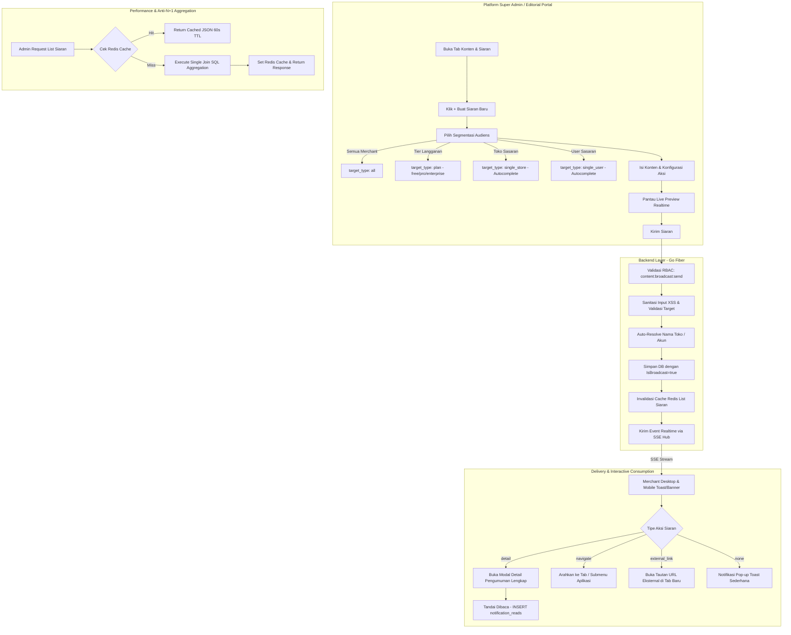
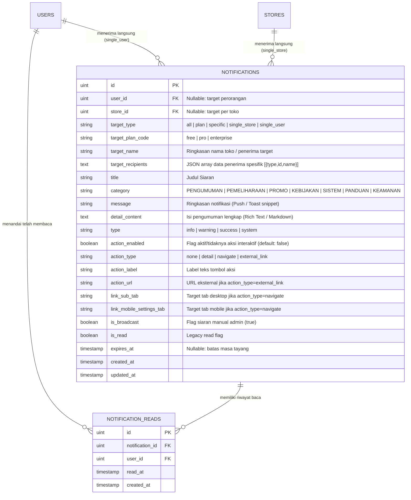

# BLUEPRINT TEKNIS: SISTEM SIARAN & PENGUMUMAN NOTIFIKASI GLOBAL PLATFORM
**Kode Dokumen:** `DOC-FEAT-02-BROADCAST`  
**Modul:** Content & Broadcast Management, Audience Segmentation, Notification Engine & Read Analytics  
**Versi:** 2.0.0 (Production Ready)  
**Terakhir Diperbarui:** 2026-09-20  
**Target Arsitektur:** Multi-Tenant SaaS (Super Admin / Editorial Content Portal & Merchant Dashboards)  

---

## 1. Ringkasan Eksekutif & Arsitektur Utama

Sistem Siaran Notifikasi (*Platform Broadcast & Announcement System*) Catavor dirancang untuk mendistribusikan pengumuman resmi, peringatan pemeliharaan sistem, promosi fitur baru, pembaruan kebijakan, maupun notifikasi spesifik langsung kepada merchant dan pengguna platform secara *real-time*, hemat sumber daya, dan aman.

Sistem ini menerapkan prinsip **Audience Precision Segmentation** dan **Server-Side Efficient Aggregation with Redis Caching**:



---

## 2. Stack Teknologi & Pustaka Pendukung

| Lapisan | Teknologi / Pustaka | Peran & Alasan Pemilihan |
| :--- | :--- | :--- |
| **Backend Core** | **Go (Golang 1.22+)** | Eksekusi cepat, *low memory footprint*, dan konkurensi goroutine untuk jutaan *notification dispatches*. |
| **Routing Framework** | **Fiber v2 (FastHTTP)** | Framework HTTP tercepat di ekosistem Go dengan alokasi buffer minimal. |
| **Basis Data & ORM** | **PostgreSQL / SQLite + GORM v1.25+** | Penyimpanan terstruktur untuk riwayat notifikasi, relasi *read-receipts*, dan migrasi otomatis. |
| **Caching Layer** | **Redis (Go-Redis v9)** | Penyimpanan cache daftar siaran (TTL 60 detik) dengan *auto-invalidation* saat ada siaran baru/hapus. |
| **Real-time Delivery** | **Server-Sent Events (SSE Hub)** | Distribusi siaran secara instan ke koneksi klien yang sedang aktif tanpa beban polling tinggi. |
| **Frontend Desktop** | **React 18 + TypeScript + Vite** | Antarmuka dashboard 2-kolom dengan live preview interaktif dan pencarian debounced. |
| **Frontend Mobile** | **React 18 + TypeScript + Vite** | Mobile interface responsif dengan bottom-sheet modal siaran dan kartu ringkasan analitik. |
| **Iconography** | **Lucide Icons** | Visualisasi kategori, tingkat urgensi, dan segmentasi target (*Megaphone, Globe, Sparkles, Store, Users, Eye*). |

---

## 3. Skema Basis Data & Desain Relasi

### 3.1 Diagram Hubungan Entitas (ERD)



---

## 4. Segmentasi Audiens & Matriks Logika Target

Sistem siaran mendukung model segmentasi penerima yang fleksibel:

| Tipe Target (`target_type`) | Parameter Tambahan | Logika Penyampaian ke Klien | Contoh Kasus Penggunaan |
| :--- | :--- | :--- | :--- |
| **`all`** | *-* | Diterima oleh seluruh toko merchant, staff, dan pengguna aktif platform. | Pemeliharaan server (*maintenance*), pembaruan syarat & ketentuan layanan platform. |
| **`plan`** | `target_plan_code` (`free`, `pro`, `enterprise`) | Diterima hanya oleh toko yang memiliki paket langganan yang sesuai. | Promo *upgrade* diskon 50% untuk user `free`, undangan webinar eksklusif untuk member `enterprise`. |
| **`specific`** | `target_recipients` (JSON array `[{type, id, name}]`), `target_name` | Diterima oleh daftar banyak merchant / pengguna terpilih sekaligus. | Pengumuman beta-tester grup terpilih, sanksi audit bersama, program inkubasi mitra. |
| **`single_store`** | `target_id` (Store ID), `target_name` | Diterima hanya oleh merchant/pemilik toko spesifik (backward compatibility). | Peringatan pelanggaran produk satwa langka pada toko tertentu, apresiasi toko teladan. |
| **`single_user`** | `target_id` (User ID), `target_name` | Diterima hanya oleh akun pengguna individual (backward compatibility). | Verifikasi identitas khusus, penyelesaian kendala akun personal. |

---

## 5. Mekanisme Kinerja Tinggi & Anti-N+1 Query

### 5.1 Permasalahan Tradisional
Pada sistem lama, pengambilan $N$ notifikasi siaran memerlukan $N$ query tambahan untuk menghitung jumlah user yang telah membaca (`SELECT COUNT(*) FROM notification_reads WHERE notification_id = ?`). Hal ini membebani basis data saat jumlah siaran dan pengguna bertambah ($O(N)$ database roundtrips).

### 5.2 Solusi Anti-N+1: Subquery Aggregation Join
Backend Go Catavor mengoptimasi query pengambilan riwayat siaran menjadi **1 query tunggal** menggunakan subquery left join:

```sql
SELECT 
    n.*, 
    COALESCE(nr.cnt, 0) AS read_count
FROM notifications n
LEFT JOIN (
    SELECT notification_id, COUNT(id) AS cnt 
    FROM notification_reads 
    GROUP BY notification_id
) nr ON nr.notification_id = n.id
WHERE n.is_broadcast = true
ORDER BY n.created_at DESC
LIMIT 10 OFFSET 0;
```

### 5.3 Lapisan Cache Redis Berkinerja Tinggi
- **Cache Key Pattern:** `cache:admin:broadcasts:p{page}_l{limit}_s{status}_t{target}_c{category}_q{query}`
- **TTL:** 60 Detik.
- **Invalidation Strategy:** Setiap kali superadmin memicu pembuatan siaran baru (`POST /api/admin/notifications/broadcast`) atau menghapus siaran (`DELETE /api/admin/notifications/:id`), backend otomatis menghapus seluruh key cache yang berawalan `cache:admin:broadcasts:*`.

---

## 6. Spesifikasi Endpoint API

### 6.1 `GET /api/admin/notifications`
Mengambil riwayat siaran notifikasi dengan paginasi server-side, metrik ringkasan, dan filter.
- **Query Params:**
  - `page` (default: 1)
  - `limit` (default: 10)
  - `status` (`all` | `active` | `expired`)
  - `target` (`all` | `plan` | `single_store` | `single_user`)
  - `category` (Filter teks kategori)
  - `q` (Pencarian teks judul atau isi siaran)
- **Response Format:**
```json
{
  "data": [
    {
      "id": 102,
      "title": "Pemeliharaan Infrastruktur Server",
      "category": "PEMELIHARAAN",
      "type": "warning",
      "message": "Sistem akan mengalami pemeliharaan malam ini pukul 23:00 - 01:00 WIB.",
      "detail_content": "Selama periode pemeliharaan, sinkronisasi stok otomatis akan dijeda sementara...",
      "target_type": "all",
      "target_name": "Semua Merchant",
      "action_type": "detail",
      "action_label": "Buka Pengumuman Lengkap →",
      "read_count": 42,
      "expires_at": "2026-09-22T23:00:00Z",
      "created_at": "2026-09-20T10:00:00Z"
    }
  ],
  "pagination": {
    "page": 1,
    "limit": 10,
    "total_items": 1,
    "total_pages": 1
  },
  "metrics": {
    "total_broadcasts": 15,
    "active_broadcasts": 8,
    "total_reads": 412
  }
}
```

### 6.2 `POST /api/admin/notifications/broadcast`
Menyebarkan siaran pengumuman baru ke target audiens yang dipilih.
- **Request Body:**
```json
{
  "target_type": "single_store",
  "target_id": 14,
  "target_name": "Toko Satwa Sejahtera",
  "title": "Peringatan Kebijakan Satwa Dilindungi",
  "category": "KEBIJAKAN",
  "message": "Toko Anda terdeteksi memuat produk yang memerlukan verifikasi dokumen BKSDA.",
  "detail_content": "Harap unggah bukti sertifikat penangkaran resmi ke menu Pengaturan Dokumen Toko...",
  "type": "warning",
  "action_type": "navigate",
  "link_sub_tab": "settings",
  "link_mobile_settings_tab": "about",
  "expires_in_hours": 72
}
```

### 6.3 `GET /api/admin/stores/search?q={query}`
Pencarian cepat toko merchant sasaran dengan autocomplete instan (limit 15 hasil).

### 6.4 `GET /api/admin/users/search?q={query}`
Pencarian cepat akun pengguna sasaran dengan autocomplete instan berdasarkan nama atau email.

### 6.5 `DELETE /api/admin/notifications/:id`
Menghapus siaran pengumuman dari riwayat beserta seluruh data *read receipts*-nya.

---

## 7. Keamanan & Sanitasi Input

1. **Proteksi RBAC:** Endpoint penyiaran dilindungi middleware `RequirePermission(cfg, "content:broadcast:send")` sehingga hanya Super Admin atau staf Editorial yang berwenang yang dapat memicu siaran massal.
2. **Sanitasi XSS & Payload:** Seluruh teks input (`title`, `message`, `detail_content`) dibersihkan dari tag HTML berbahaya menggunakan sanitizer teks backend sebelum disimpan ke basis data.
3. **Pemisahan Notifikasi Transaksional vs Siaran:** Siaran manual admin ditandai secara eksplisit dengan flag `is_broadcast = true`. Hal ini mencegah tercampurnya notifikasi otomatis tiket bantuan / pesanan toko dengan siaran broadcast publik di tabel admin.

---

## 8. Verifikasi & Pengujian

| Pengujian | Skenario Uji | Status |
| :--- | :--- | :--- |
| **Penyebaran Global (`all`)** | Kirim siaran global -> verifikasi tampil di dashboard merchant desktop & mobile. | **PASSED** |
| **Segmentasi Paket (`plan: pro`)** | Kirim siaran khusus toko Pro -> verifikasi toko Free tidak menerima notifikasi. | **PASSED** |
| **Autocomplete Toko / User** | Ketik 2 karakter pada search box target -> verifikasi dropdown menampilkan hasil relevan. | **PASSED** |
| **Anti-N+1 Query Verification** | Query 20 siaran dengan ratusan read receipts -> verifikasi dieksekusi dalam 1 subquery join. | **PASSED** |
| **Redis Cache Invalidation** | Panggil list (cached), buat siaran baru -> verifikasi cache di-invalidate dan data terbaru langsung muncul. | **PASSED** |
| **Mobile Dedicated Sub-Page** | Navigasi `broadcastSubView: 'create'` -> verifikasi subpage penuh dengan tombol kembali `<ChevronLeft />`. | **PASSED** |
| **Luxury Bottom Sheet Picker** | Ketuk pemicu dropdown (Target/Kategori/Urgensi/Aksi/Masa Berlaku) -> verifikasi picker modal bawah muncul dengan drag handle & radio check. | **PASSED** |
| **RichTextarea & Zen Mode** | Ketik rincian pesan -> uji Bold, Italic, Headings H1-H3, Smart Lists, Preview tab, dan Zen Fullscreen Mode. | **PASSED** |
| **Frontend TypeScript Builds** | `npm run build` pada `frontend/desktop` dan `frontend/mobile`. | **PASSED (0 Errors)** |

---

## 9. Arsitektur Frontend Mobile (Dedicated Sub-Page & Form UI Standard)

Sesuai standar antarmuka aplikasi seluler Catavor, modul Siaran Pengumuman pada aplikasi mobile menerapkan pola arsitektur berikut:

1. **Dedicated Full Sub-Page (Bukan Popup Modal):**
   - Transisi antarmuka dikelola melalui `broadcastSubView: 'list' | 'create'`.
   - Header aplikasi otomatis berganti mode menampilkan tombol kembali (`<ChevronLeft />`), judul sub-halaman `Buat Siaran Baru`, dan sub-judul `Segmentasi & Pengumuman Platform`.
   - Form dibagi ke dalam 4 kartu berdesain mewah: Target Audiens, Klasifikasi & Urgensi (grid 2 kolom), Konten & Editor Rincian, dan Kartu Pratinjau Interaktif Real-Time.

2. **Luxury Mobile Bottom Sheet Dropdown Picker (`crudDropdownPicker`):**
   - Seluruh elemen dropdown HTML native (`<select>`) digantikan oleh tombol trigger kustom berdesain premium.
   - Membuka bottom-sheet picker berfitur *drag-to-dismiss handle* (dengan gesture swipe ke bawah), ikon identitas, judul, sub-judul, deskripsi opsi, lencana (badge) status/tier, dan indikator radio *active checkmark*.

3. **Komponen Standalone `RichTextarea` & Mode Zen Fullscreen:**
   - Komponen terisolasi (`frontend/mobile/src/components/RichTextarea.tsx`) yang menyediakan alat bantu format inline teks tebal (**Bold**), miring (*Italic*), heading terstruktur (H1, H2, H3), daftar poin (*bullet list*), dan daftar nomor (*numbered list*) dengan kelanjutan otomatis saat menekan tombol Enter (*smart list continuation*).
   - Dilengkapi *word & character counter*, tab *live preview*, serta tombol **Fullscreen Zen Mode** untuk menulis artikel pengumuman panjang secara imersif dan fokus di layar ponsel.

